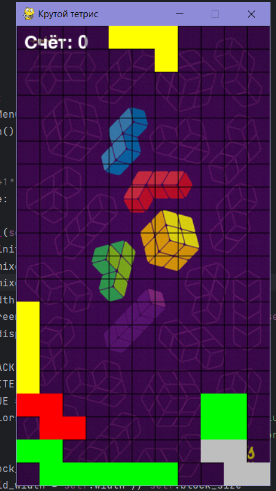
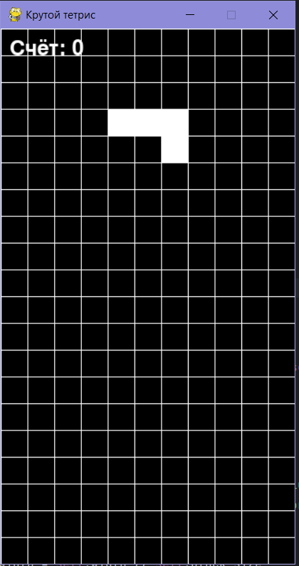

Крутой Тетрис

Курилов Лев и Рябов Савелий

Описание идеи: тетрис с музыкой и темами

Описание реализации: для каждого окна есть свой класс, например: Menu, TetrisGame

Описание технологий:

    встроенные библиотеки: random, sys
    сторонние библиотеки: pygame

